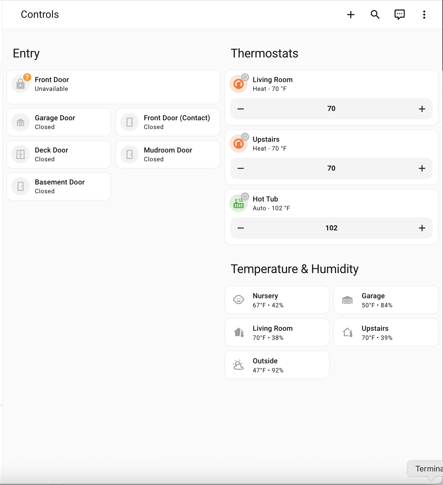

# Control

Sanitized Control dashboard package for everyday entry, climate, and ambient sensor workflows.

## Files

- `dashboard.yaml` - sanitized dashboard definition
- `images/dashboard.png` - add one screenshot here

## Requirements

- Mushroom cards (`mushroom-title-card`, `mushroom-lock-card`, `mushroom-entity-card`, `mushroom-climate-card`, `mushroom-template-card`)
- Lock, binary sensor, climate, and temperature/humidity entities that match your environment

## Sanitization notes

This package replaces household-specific entity IDs and names with neutral placeholders.

Update entity IDs and any `!secret` values (for example `control_room_label_1`) to your local equivalents.

## Screenshot

Place your screenshot at:

- `images/dashboard.png`

