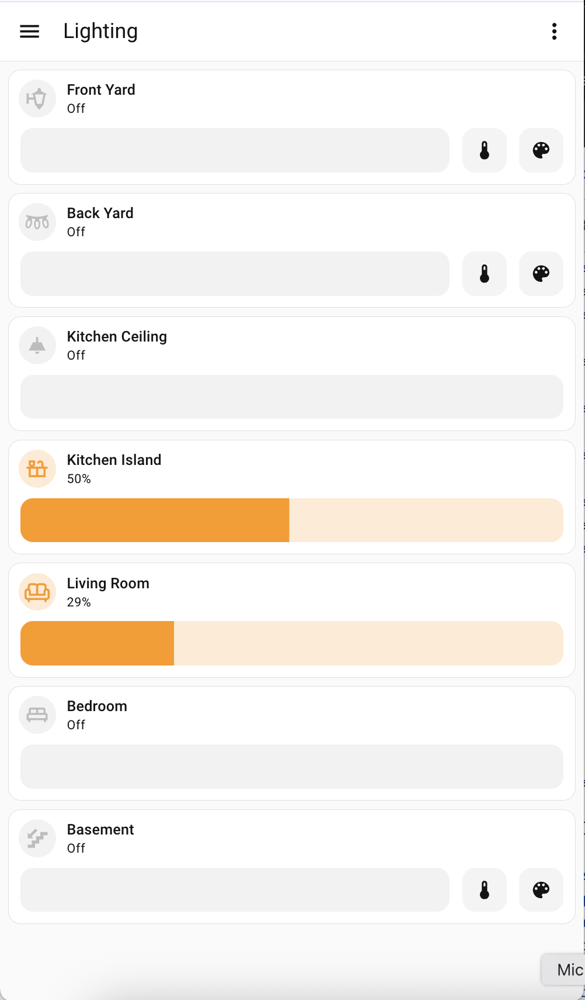

# Lighting

Sanitized Lighting dashboard package for quick room and zone light control.

## Files

- `dashboard.yaml` - sanitized dashboard definition
- `images/dashboard.png` - add one screenshot here

## Requirements

- Mushroom light card (`custom:mushroom-light-card`)
- Light entities with brightness/color support (or adjust card options for your setup)

## Sanitization notes

This package replaces household-specific entity IDs with neutral names.

Update entity IDs to match your own Home Assistant installation.

## Screenshot

Place your screenshot at:

- `images/dashboard.png`

