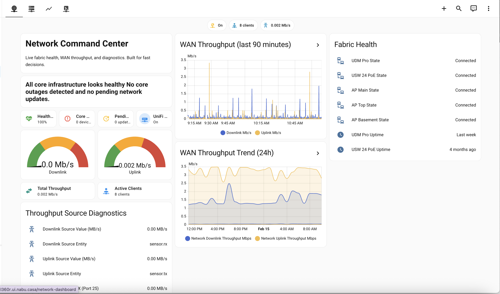

# Network

Sanitized Network dashboard package for WAN visibility, infrastructure health, and operational controls.

## Files

- `dashboard.yaml` - sanitized dashboard definition
- `helpers.yaml` - helper template sensors required by this dashboard
- `images/dashboard.png` - add one screenshot here

## Requirements

- Core network entities for gateway, switch, APs, and service toggles
- Throughput source sensors used by `helpers.yaml`
- Button entities for restart and PoE power-cycle actions
- Lovelace core cards (tile, gauge, markdown, entities, history/statistics graph)

## Sanitization notes

This package replaces household-specific device names and service identifiers with neutral placeholders.

Update entities in both `dashboard.yaml` and `helpers.yaml` to match your own network inventory.

## Screenshot

Place your screenshot at:

- `images/dashboard.png`

