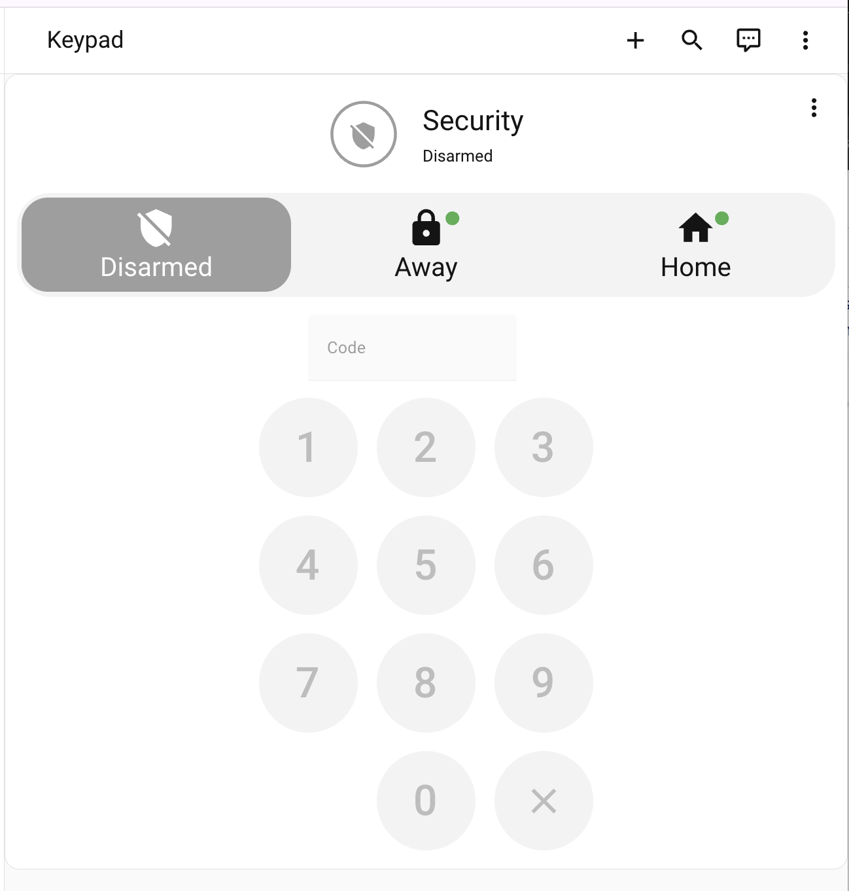

# Security

Sanitized Security dashboard package focused on a full-screen alarm keypad experience.

## Files

- `dashboard.yaml` - sanitized dashboard definition
- `images/dashboard.png` - add one screenshot here

## Requirements

- Alarmo integration
- `custom:alarmo-card`
- An alarm control panel entity in your Home Assistant setup

## Sanitization notes

This package keeps alarm dashboard structure but replaces environment-specific entity IDs with neutral placeholders.

Update `alarm_control_panel.home_alarm` and any secrets (for example `security_dashboard_title`) for your environment.

## Screenshot

Place your screenshot at:

- `images/dashboard.png`

