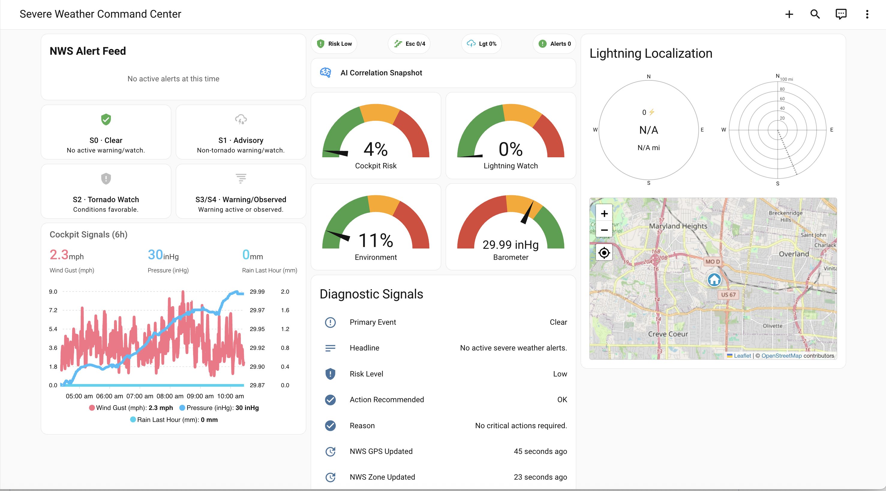

# Severe Weather

Current Severe Weather Command Center dashboard package.

## Files

- `dashboard.yaml` - sanitized current dashboard
- `helpers.yaml` - helper template and binary sensors used by this dashboard
- `scripts.yaml` - script referenced by dashboard action card
- `images/dashboard.png` - add one screenshot here

## Requirements

- NWS Alerts integration + `custom:nws-alert-card`
- Mushroom cards
- ApexCharts card
- Blitzortung Lightning Card
- Entity Progress Card (`custom:entity-progress-card-template`)
- Camera entities for live exterior views (`camera.local_front_door`, `camera.local_backyard`)
- Script entity: `script.severe_weather_ai_correlation_snapshot` (or equivalent)

### Line gauges under the gauge grid

The current dashboard includes two full-width horizontal line gauges below the standard semicircle gauge grid:

- Rain Intensity (`in/hr`)
- Wind Gust (`mph`)

Implementation notes:

- Percent is templated and clamped to 0-100.
- Bar color is threshold-based (green -> yellow -> orange -> red).
- Shimmer effect is conditional and only enabled at elevated values.
- Cards use `frameless: true`, `marginless: true`, and a consistent `height` for compact stacking.

Default full-scale values used by the templates:

- Rain intensity: `2.0 in/hr`
- Wind gust: `60 mph`

Optional helper entities for runtime tuning (without editing dashboard YAML):

- `input_number.storm_rain_rate_full_scale`
- `input_number.storm_wind_gust_full_scale`

### Side-by-side live exterior cameras

The current dashboard includes two always-live `picture-entity` cards in a 2-column grid, directly below
Lightning Localization:

- Left: `camera.local_front_door`
- Right: `camera.local_backyard`

Implementation notes:

- `camera_view: live`
- Text-free display (`show_name: false`, `show_state: false`)
- `aspect_ratio: '16:9'`
- `tap_action: more-info`

### AI snapshot helper entities required

This dashboard/script pattern expects these helper entities in your HA config:

- `input_text.storm_ai_snapshot_summary`
- `input_text.storm_ai_snapshot_confidence`
- `input_text.storm_ai_snapshot_watch_window`
- `input_text.storm_ai_snapshot_recommended_action`
- `input_number.storm_ai_snapshot_interval_minutes` (default `60`)
- `input_datetime.storm_ai_snapshot_last_updated`

The AI blurb card is always visible, shows a first-run message when no snapshot has run yet,
and manual tap-to-refresh still forces an on-demand update.

The included script uses broad weather context (NWS + storm helper sensors + local weather +
lightning metrics) while instructing the model to ignore unknown/unavailable values.

## Sanitization notes

This share package redacts environment-specific identifiers and uses neutral local sensor names.

The included `scripts.yaml` is also sanitized and expects your local AI task/weather entities.

Update these entities to match your own installation.

## Screenshot

Place your screenshot at:

- `images/dashboard.png`

