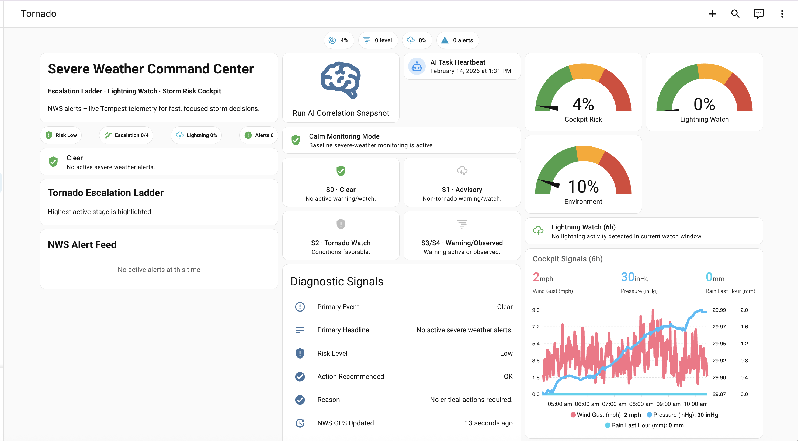

# Severe Weather (v1)

Original Severe Weather dashboard snapshot package, preserved for comparison.

## Files

- `dashboard.yaml` - sanitized v1 dashboard definition
- `helpers.yaml` - helper template and binary sensors used by this dashboard
- `scripts.yaml` - script referenced by dashboard action card
- `images/dashboard.png` - add one screenshot here

## Requirements

- NWS Alerts integration + `custom:nws-alert-card`
- Mushroom cards
- ApexCharts card
- Script entity: `script.severe_weather_ai_correlation_snapshot` (or equivalent)

## Sanitization notes

This package redacts environment-specific identifiers and replaces them with neutral names.

The included `scripts.yaml` is also sanitized and expects your local AI task/weather entities.

Update these entities to your local equivalents before use.

## Screenshot

Place your screenshot at:

- `images/dashboard.png`

