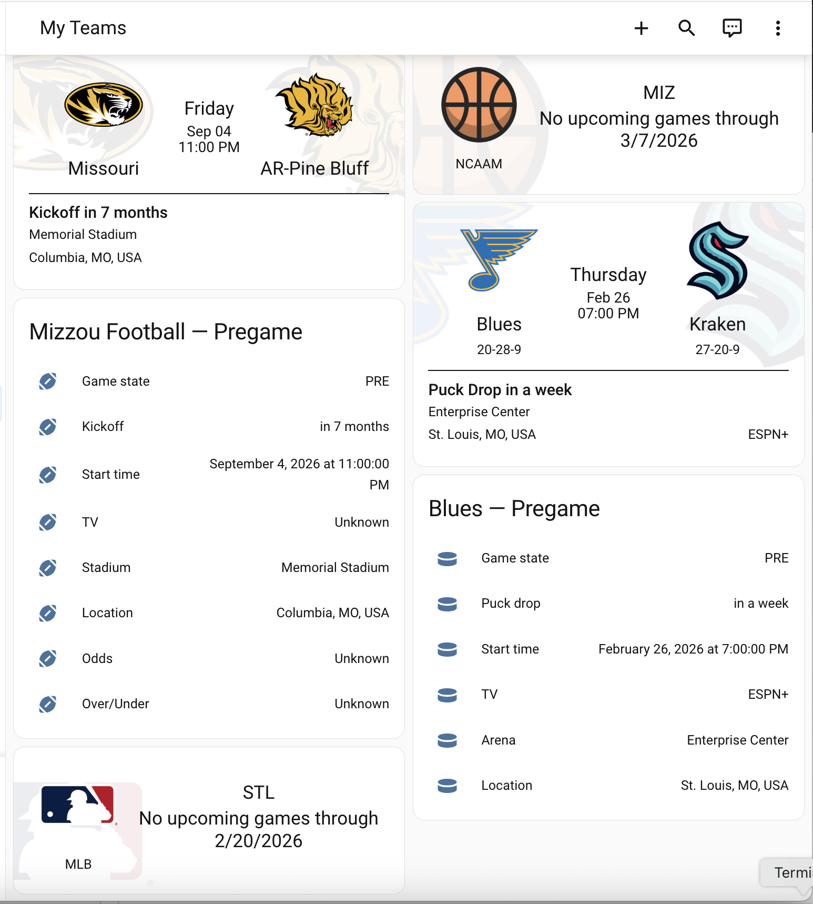

# Sports Tracker

Sanitized Sports Tracker dashboard package for following multiple teams with pregame/live/final conditional detail cards.

## Files

- `dashboard.yaml` - sanitized dashboard definition
- `images/dashboard.png` - add one screenshot here

## Requirements

- TeamTracker integration
- `custom:teamtracker-card`
- Team sensor entities exposing expected game attributes

## Sanitization notes

This package replaces team-specific entity IDs and labels with neutral placeholders (`sensor.team_football`, etc.).

Map each placeholder sensor to your own team tracker entities.

## Screenshot

Place your screenshot at:

- `images/dashboard.png`

