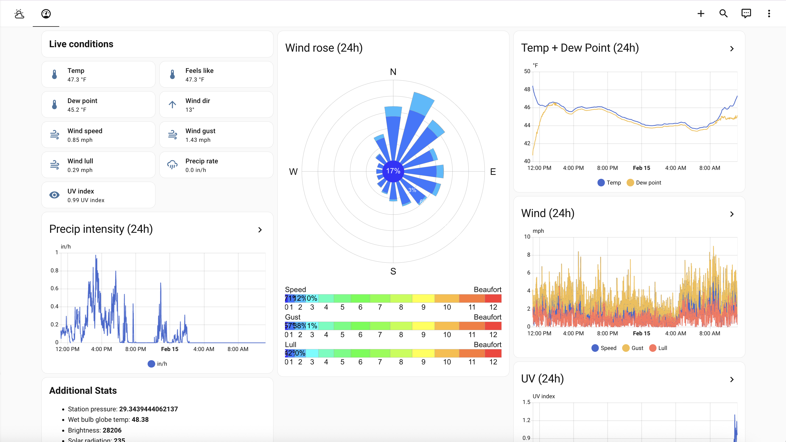

# Weather

Sanitized Weather dashboard package for live station telemetry, history graphs, and optional embedded station UI.

## Files

- `dashboard.yaml` - sanitized dashboard definition
- `images/dashboard.png` - add one screenshot here

## Requirements

- Weather station entities for temperature, wind, precipitation, UV, and station health
- `custom:windrose-card`
- Secret URL value for `weather_station_url`

## Sanitization notes

This package replaces station-specific entity IDs and location references with neutral `local_weather_*` placeholders.

Update entity IDs and secret values to match your weather integration.

## Screenshot

Place your screenshot at:

- `images/dashboard.png`

